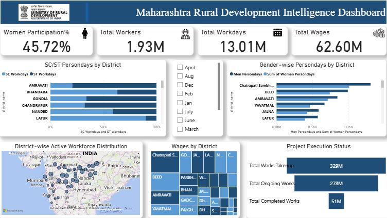
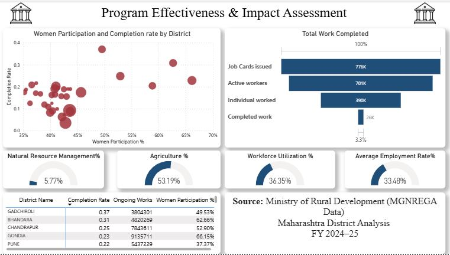

# Maharashtra-Rural-Development-Intelligence-Dashboard
Power BI dashboard analyzing rural employment, workforce participation, project execution, and social inclusion using Maharashtra MGNREGA data.

### What is MGNREGA?

The Mahatma Gandhi National Rural Employment Guarantee Act (MGNREGA) is a landmark Indian social welfare and labor law. It legally guarantees at least 100 days of wage employment in a financial year to every rural household whose adult members volunteer to perform unskilled manual work.

## Project Overview

This project is an interactive Power BI dashboard built using Maharashtra MGNREGA data. The dashboard analyzes rural employment, workforce participation, project execution, social inclusion, and development activities across districts.

The goal of this project is to understand how effectively a large-scale government employment scheme is being implemented and how it impacts rural communities.

---

## Dashboard Preview

### Page 1 - Rural Development Intelligence Dashboard

()

### Page 2 - Program Effectiveness & Impact Assessment

()

---

## What This Dashboard Analyzes

### Employment Generation

* Total workers registered under the scheme
* Total persondays generated
* Active workforce participation

### Social Inclusion

* Women participation in rural employment
* SC/ST workforce contribution across districts

### Financial Analysis

* Wage expenditure distribution
* District-wise wage allocation

### Project Execution

* Works initiated
* Ongoing projects
* Completed projects

### Rural Development Focus

* Agriculture-related activities
* Natural Resource Management (NRM) activities

---

## Key Metrics

* Women Participation: 45.72%
* Total Workers: 1.93 Million
* Total Persondays Generated: 13.01 Million
* Total Wages Paid: 62.60 Million
* Workforce Utilization: 36.35%
* Employment Achievement Rate: 33.48%

---

## Key Insights

- ### Seasonal Employment Trends

Using the month slicer, it was observed that employment levels fluctuate throughout the year. Employment generation, wages, and workforce participation gradually decline toward December, making it one of the lowest-performing months.

- ### Peak Performance in March

March recorded the highest workforce activity, with women participation reaching approximately 52%. The number of completed works and overall employment generation were also higher during this period.

- ### Women Participation

Women contributed significantly to rural employment, accounting for nearly 46% of total persondays on average. Participation levels varied across months and districts.

- ### Large Employment Generation

The scheme generated over 13 million persondays of work, supporting employment opportunities across Maharashtra districts.

- ### Workforce Utilization Opportunity

Only 36.35% of registered workers are actively participating, indicating potential to improve workforce engagement.

- ### Employment Achievement

On average, households achieve approximately 33% of the 100-day employment guarantee, suggesting room for better utilization of the scheme.

- ### Strong Agriculture Focus

More than half of the expenditure is directed toward agriculture-related activities, supporting rural livelihoods and development.

- ### Social Inclusion Impact

SC and ST communities represent a significant portion of the workforce, highlighting the scheme's role in inclusive employment generation.

---

## Tools & Technologies

* Power BI
* DAX
* Microsoft Excel
* Data Visualization
* Dashboard Design
* Data Analysis

---

## Skills Demonstrated

* Data Cleaning & Transformation
* KPI Development
* DAX Calculations
* Dashboard Design
* Data Storytelling
* Public Sector Analytics
* Business Intelligence Reporting

---

## Why This Project Matters

Most dashboard projects focus on sales, customers, or revenue. This project focuses on a real-world public welfare program and demonstrates how data can be used to evaluate employment generation, inclusion, and development outcomes at a district level.

---

## Author

**Riddhi Kadam**

Aspiring Data Analyst | Research Analyst | Business Analytics Enthusiast
